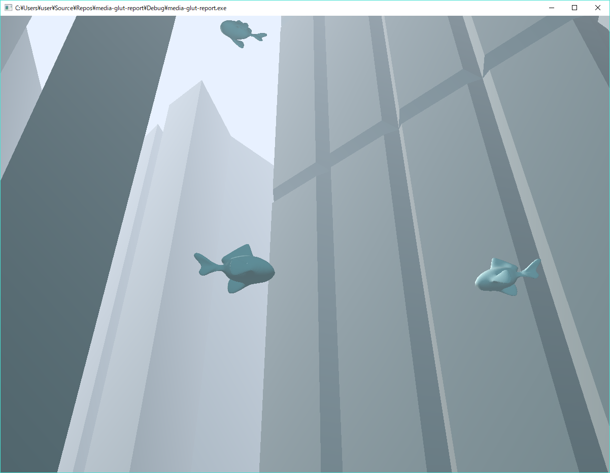
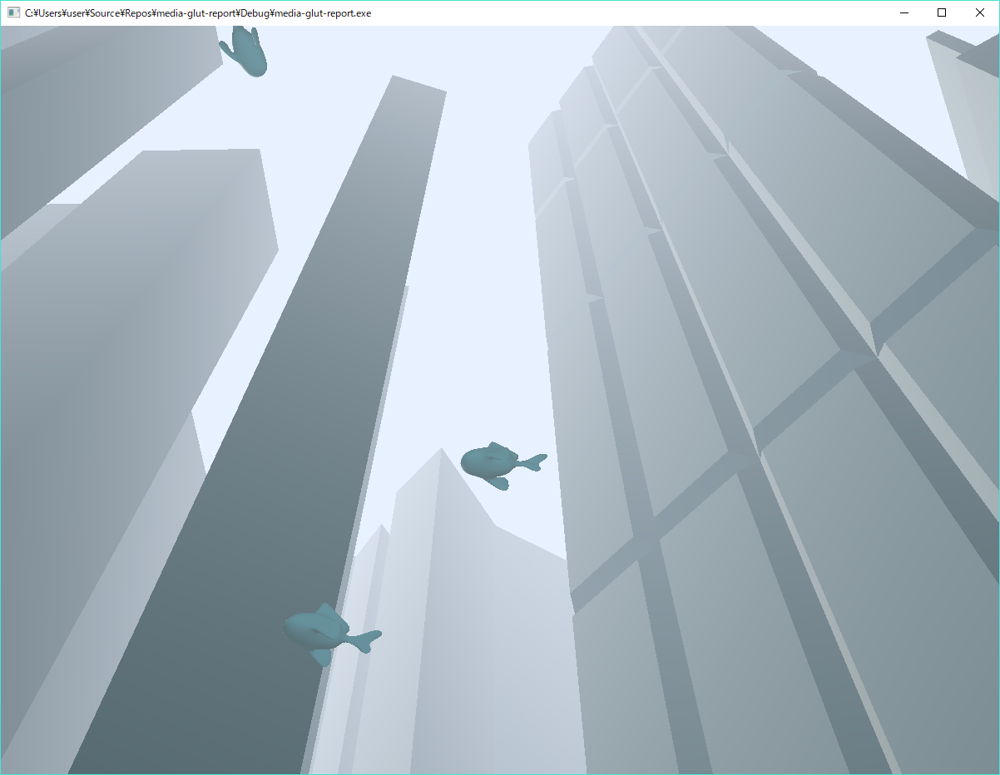
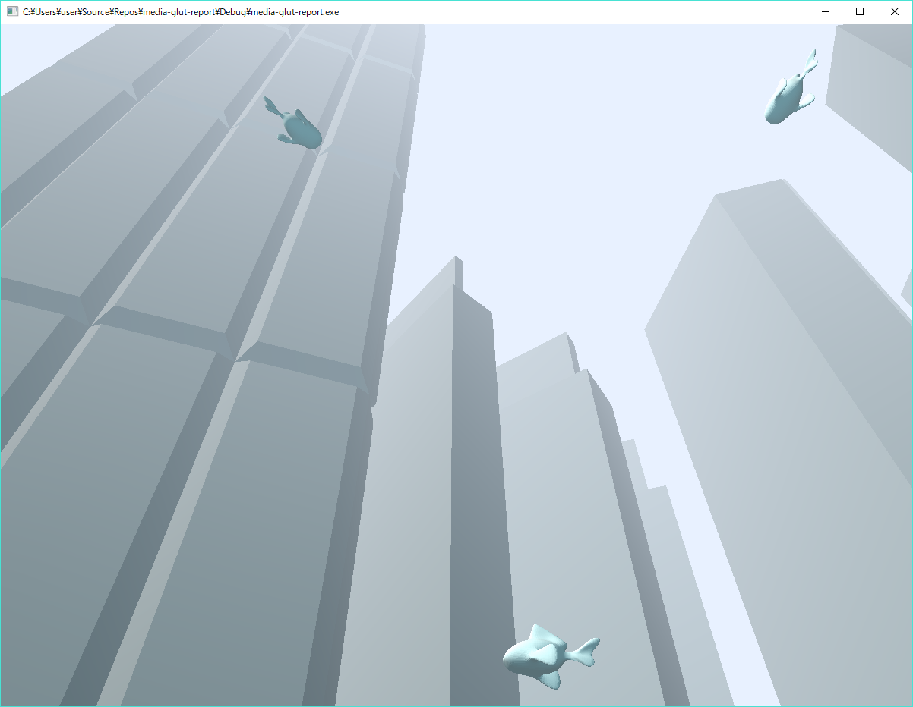

# メディア情報学実験 第3回目：レポート課題

### 概要

* 水没都市をイメージしたシーン







### 使い方

* GLUTの導入(省略)

#### Windowsの場合

* `./media-glut-report.sln`をVisualStudioで読み込んだ後、ソリューションのプロパティを導入したGLUTのパスなどに従って変更

#### Linuxの場合

* `./media-glut-report/compile`に実行権限を付与して実行
* OR ```g++ main.cpp envconfig.cpp  SceneObject.cpp objload.cpp resources.cpp -lglut -lGLU -lGL -lm -w -std=c11 -lpthread -o ccrepo```

### 操作方法

* W/A/S/D - 上左下右への移動
* マウス - 視点移動

### こだわり

#### 光

CGと聞いてまず注力する点は｢見た目｣です。今回は仮想世界ということで、｢美しさ｣が一つの方向性として挙げられると思います。美しさ、というと精細なポリゴンやテクスチャが思い当たりますが、実はこれらはさほど必要ではなく、光表現のほうがよほど大切です。今回は技術的制約もありますがポリゴンやテクスチャはあえて使わず、FOGと光源だけで美しいと思える描画を目指しました。

霧は寒色にしてあります。これは空気遠近法にもとづいており、遠くのものを青く薄く表現するだけで人間はその物体を遠くにあると感じます。

光源は現実と同じように2種類設けてあります。まずは直接光で、太陽光に相当します。これは真っ白ではなく若干暖色にしてあります。次に環境光で、大気からの反射光に相当します。これは寒色になっています。立体感の表現において、光源を暖色、反射光や影を寒色にすることは人間の認知において非常に自然なものになっています。

これらの工夫によって、テクスチャやポリゴンどころかマテリアル設定さえ詳細にせずとも十分に現実的かつ非現実的なシーンを作ることができます。

#### プログラム

表に見えない部分のこだわりとしてプログラムそのものがあります。

まず3Dオブジェクトの読み込みに対応させた点です。メタセコイアを読み込むライブラリを利用しても良いですが、Wavefront 3D形式(`*.obj`)はファイル内容がASCIIで比較的簡単であり、かつ過去に自分がパーサーを書いたことがあるためオリジナルのコードを利用することにしました。現状マテリアルの設定には対応していません。

また、シーン中に描画される物体をすべて`SceneObject`クラスもしくはその継承クラスで管理しています。このクラスによって生成されたオブジェクトはすべて物体として位置や角度を持つように他のコードから操れるため、プログラムの処理結果と物体の位置等の関連性をスッキリ記述できます。このあたりは3Dゲームエンジン Unity を少し参考にしています。

他にも色々ありますが、基本的に自分がコードを書いている最中に、どこに記述されているかを思い出すのに苦労しないようにやっていました。

#### 最終目標

実現しませんでしたが、最終的には[boid](https://ja.wikipedia.org/wiki/%E3%83%9C%E3%82%A4%E3%83%89_(%E4%BA%BA%E5%B7%A5%E7%94%9F%E5%91%BD))を魚に実装してより｢泳いでいる感｣を出すことが目標でした。

#### 他、様々な都合上実装できなかったものの例

* 天使の階段等より水らしい表現
* 3Dモデルのマテリアルとテクスチャ設定を含めたインポート
* よりUnityライクな設計

#### 既知の不具合

* Linuxで動かしたときにマウスによる視点移動がおかしい
  * `void motion(int x, int y)` ブロック内部の挙動がWindowsと異なる
* `q`キーで終了したときにセグフォが発生する

### 感想

あくまでも｢どういう世界を作るのか｣という課題ではあると思いますが、CGを深く知るわけでもなく、システムを考えるものでもなく、かといってリッチな表現を活用していくわけでもない、微妙な立ち位置にある方針だと感じました。個人的にはこれらを追求しましたが、やはりそれぞれ微妙なレベルに落ち着いてしまい、難しさを感じる次第です。